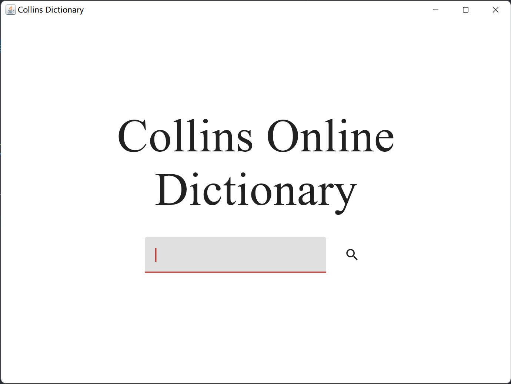
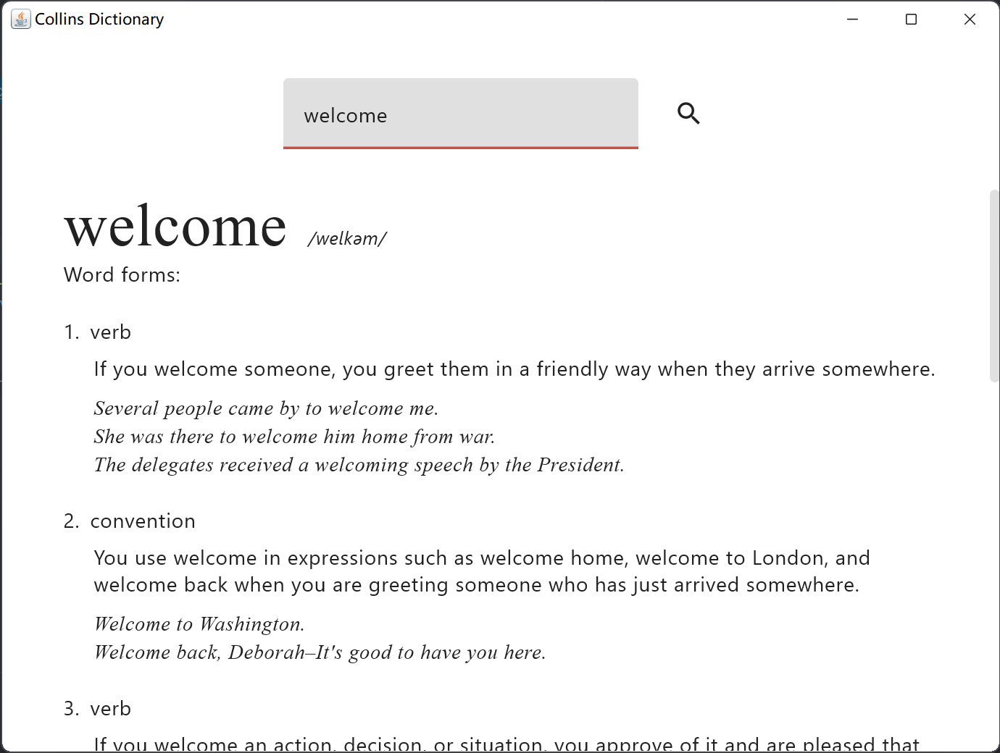

# Collins Dictionary

This is a Collins Dictionary client, GUI is built on [Jetbrains Compose](https://github.com/JetBrains/compose-jb).

> **Warning:** This program gets word definitions by parsing [Collins Online Dictionary](https://www.collinsdcionary.com) website.
> There is no license from Collins organization. This repository is for learning purposes only. Commercial use is prohibited.

**Code quality rating: F-**

## Screenshots

## TODO

- [ ] Support for multiple tab, each tab represents a word, just like a browser.
- [ ] Every word in the definition is selectable, use middle mouse button to open a new tab.
- [ ] Support for Android.