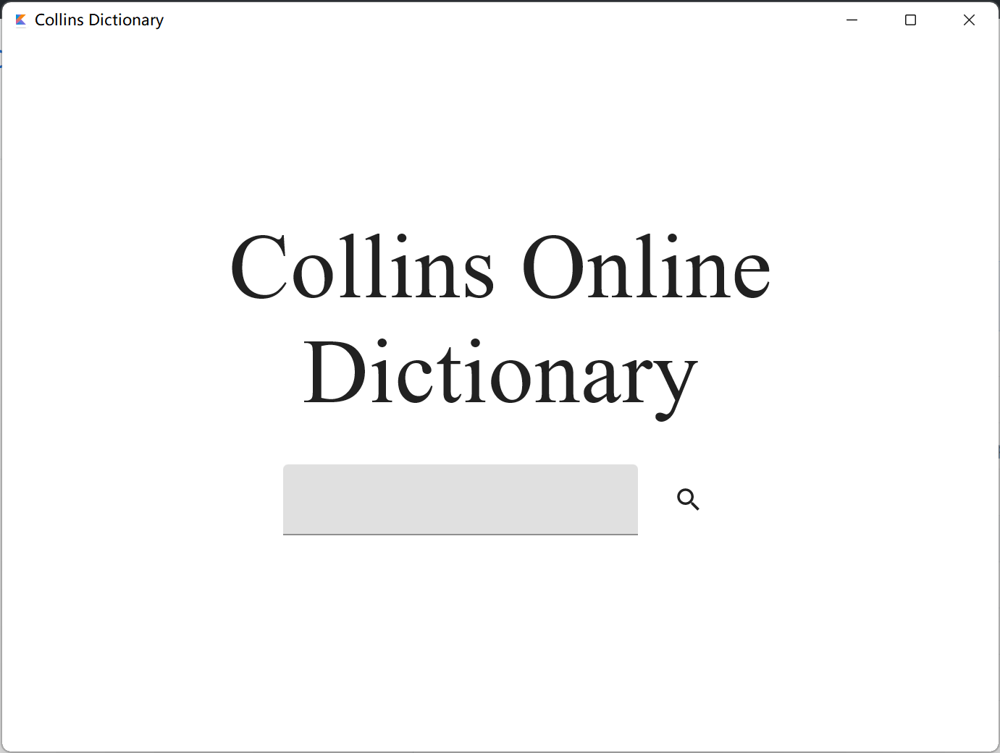
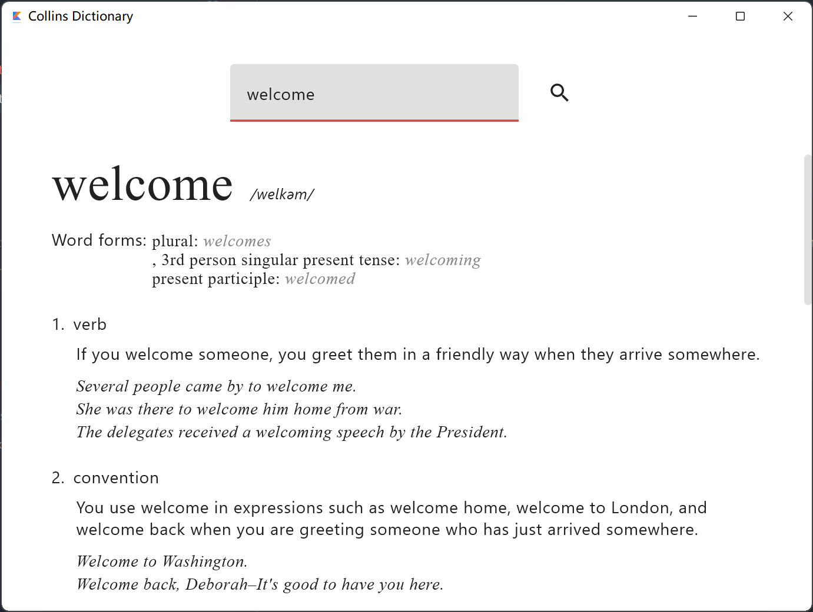
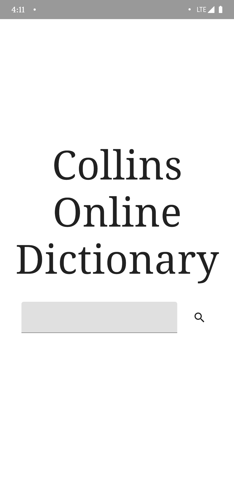
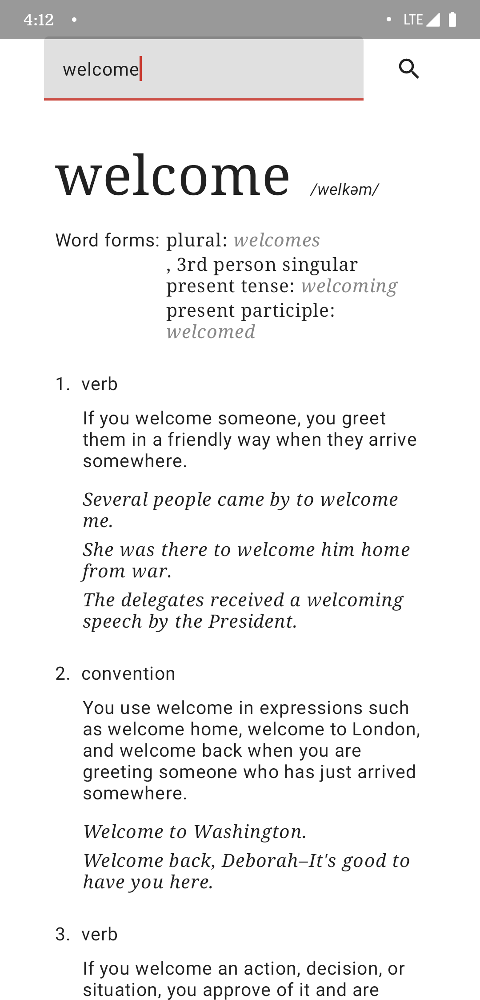
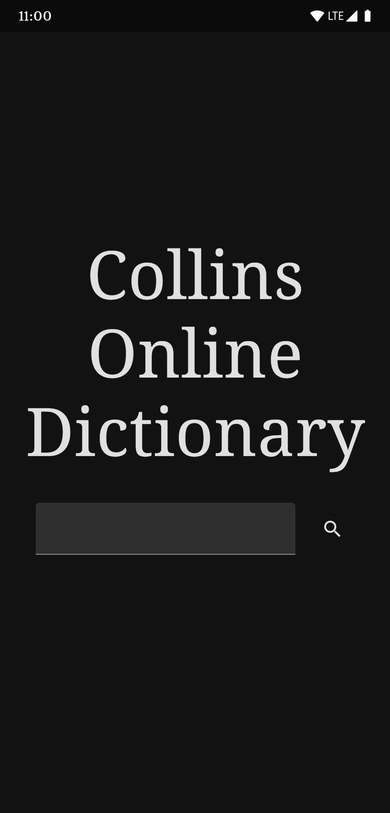
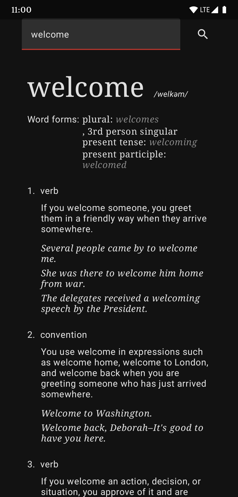

# Collins Dictionary

This is a multi-platform Collins Dictionary client, supports for Desktop(Windows/Linux/MacOS) and Android.

*For Linux and MacOS, please compile for yourself.*

UI is built on [Jetbrains Compose](https://github.com/JetBrains/compose-jb).

> **Warning:** This program gets word definitions by parsing [Collins Online Dictionary](https://www.collinsdcionary.com) website.
> There is no license from Collins organization. This repository is for learning purposes only. Commercial use is prohibited.

**Code quality rating: F-**

## Screenshots (Desktop)

## Screenshots (Android)

### Dark Mode

## TODO

- [ ] Support for multiple tab, each tab represents a word, just like a browser.
- [ ] Every word in the definition is selectable, use middle mouse button to open a new tab.
- [x] Support for Android.